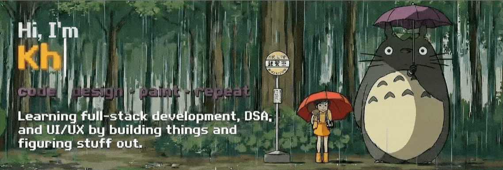

  

---

###  About Me

Hi, I’m **Khushi Bhure** 👋  
I’m a **Computer Science & Engineering student** studying at **Bangalore Institute of Technology**, India.  
🌱 learning quietly, growing slowly 🌧️

---

###  Profile Views

  

---

###  Tech Stack

  

---

###  Stats & Languages Used

<table align="center">
  <tr>
    <td>
      
    </td>
    <td>
      
    </td>
  </tr>
</table>

---

###  Contribution Activity

  

---

###  Follow Me

  

