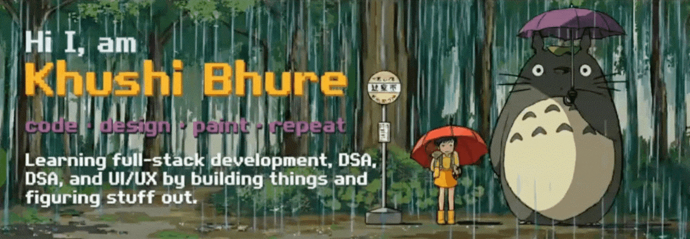

  

---

### 🌱 About Me

Hi, I’m **Khushi Bhure** 👋  
I’m a **Computer Science & Engineering student** currently studying in Bangalore Institute of Technology, India, learning and building my way through technology.

I’m interested in **full-stack development**, **data structures**, and **UI/UX**, where logic meets creativity.  
I enjoy learning by experimenting, breaking things, and fixing them again.

I believe in slow, consistent growth — progress over perfection.

---

### 👾 Languages & Tools

  

  <em>a lil bit of this, a lil bit of that 🎮</em>

---

### Stats

  

---

### 👾 Top Languages Used

  

---
