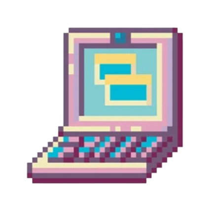

  

---

<table align="left" style="border:none;">
  <tr style="border:none;">
    <td align="left" style="border:none;">
      
    </td>
    <td align="left" style="border:none;">
      
    </td>
    <td align="left" style="border:none;">
      
    </td>
  </tr>
</table>

 

---

## Me

Hi, I’m **Khushi Bhure**  
I’m a **Computer Science & Engineering student** studying at **Bangalore Institute of Technology**, India.  

LEARN | TRY | REPEAT <3

---

##  Currently Learning

  
  
  
  
  
  

---

###  Stats & Languages Used

<table align="center">
  <tr>
    <td>
      
    </td>
    <td>
      
    </td>
  </tr>
</table>

---

##  Contribution Activity

  

---
